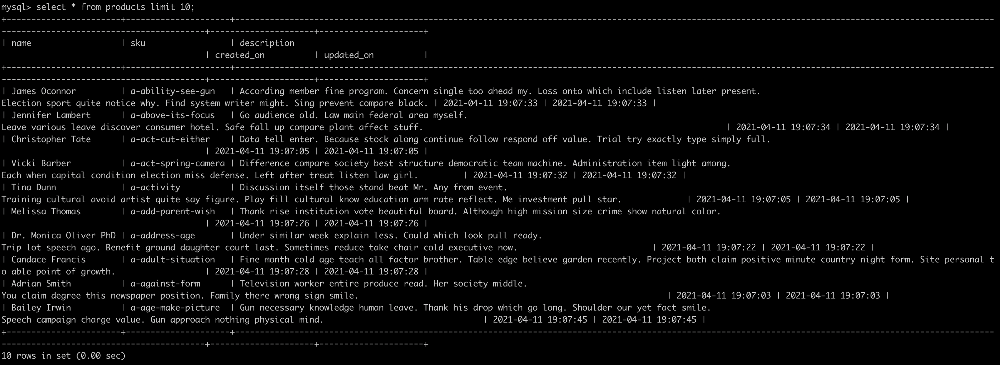
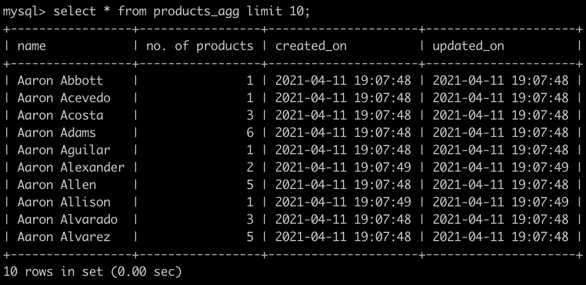

Language Used: Python(3.8.5)

Database: MySql

Steps to run the code:
* Import the repository and Run : docker-compose up -d
  * This step might take a while since database is intializing for the first time.
  * The ingestor service is waiting for database to accept connections.
* On a new terminal window Run: mysql -u root -h 127.0.0.1 -ppassword.
  * This will open the database and one can verify the results here.


## Tables Used:

### Products: This will contain the data from the csv. The schema for the following table is as given below:

|Name|sku|description|created_on|updated_on|
---|---|---|---|---
|varchar(255)|varchar(20)|Text|Datetime|Datetime|

    

### Products_agg: This contains the aggregated data, grouped on “Name” from products table

|Name|no. of products|created_on|updated_on|
---|---|---|---
|varchar(255)|int|Datetime|Datetime|


---
Commands to Recreate the tables:

```sql
CREATE TABLE `products` (
  `name` varchar(255) DEFAULT NULL,
  `sku` varchar(20) NOT NULL,
  `description` text,
  `created_on` datetime DEFAULT CURRENT_TIMESTAMP,
  `updated_on` datetime DEFAULT CURRENT_TIMESTAMP ON UPDATE CURRENT_TIMESTAMP,
  PRIMARY KEY (`sku`)
)
```
```sql
CREATE TABLE `products_agg` (
  `name` varchar(255) NOT NULL,
  `no. of products` int DEFAULT NULL,
  `created_on` datetime DEFAULT CURRENT_TIMESTAMP,
  `updated_on` datetime DEFAULT CURRENT_TIMESTAMP ON UPDATE CURRENT_TIMESTAMP,
  PRIMARY KEY (`name`)
)
```

### Points to Achieve:
1. Concept of OOPS : Done
2. Non Blocking Parallel ingestion of CSV file : Done
3. Support for updating existing products table based on primary key sku: Done
4. All Product details ingested in a single table: Done
5. Aggregated table on the above table with columns `name` and `no. of products`: Done


---

### Table “products” row count : 466,693
Sample 10 rows:


### Table “products_agg” row count: 212,751
Sample 10 rows:


---

If given more days what what would I improve:
* Support for multiple CSV files to be ingested in parallel
* Improve Exception handling
* Implement Logging to a file or database.
